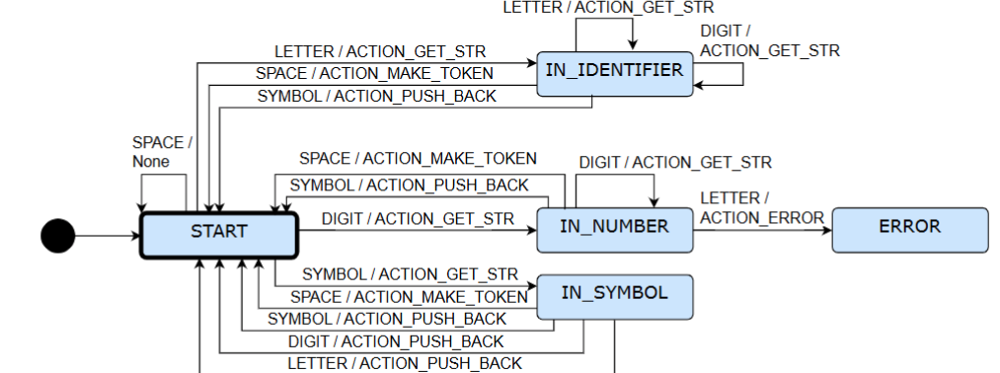

# Tarefas do Analisador Léxico

- A tarefa do analisador léxico ou scanner é transformar um fluxo de caracteres em um
fluxo de palavras na linguagem de entrada;
- Cada palavra precisa ser classificada em uma categoria sintática, ou “classe gramatical”
da linguagem de entrada;
- A análise léxica é o único passo do compilador (interpretador) a ter contato com cada
caractere do programa da entrada;
- O analisor léxico aplica um conjunto de regras que descreve a estrutura léxica da
linguagem de programação de entrada, às vezes chamada de sua microssintaxe;
- É importante que o analisador léxico seja projetado para ter um alto desempenho –
atualmente prefere‐se recorrer a programas geradores de scanner do que
implementá‐los manualmente (a menos que se tenha uma boa justificativa), como, por
exemplo, JFlex.
- O que um analisador léxico reconhece e classifica são os símbolos terminais de uma
linguagem – símbolos fixos que compõem o texto de um programa;
- Por exemplo, em Java tem‐se as categorias de símbolos:
    - Palavras reservadas: if, class, package, ...;
    - Identificadores: temp, getName, ...;
    - Constantes ou literais:``Mensagem'', 10, true, ...;
    - Sinais de pontuação: {, ;, ), ...;
    - Operadores: +, %, instanceof, ....


## Lexema, marca e atributos
- Lexema: é uma sequência de caracteres no programa fonte que corresponde ao padrão
de uma marca e é identificada pelo analisador léxico como uma instância dessa marca;
- Marca (ou token): é um símbolo com um significado atribuído. A marca pode ser um
número simples ou um tipo estruturado contendo algum tipo de identificador único
que classifique a marca (número, enumeração) e possivelmente um ou mais atributos;
- Atributo de marca: adiciona informações necessárias para se utilizar a marca de modo
conveniente. Por exemplo, pode‐se adicionar o lexema de um identificador a uma
marca do tipo identificador, bem como seu valor, para que, no analisador sintático, se
adicione ou recupere valores deste identificador em uma tabela de símbolos.


## Gramática de expressões aritméticas

- Considerar a seguinte gramática (EBNF):

```
    command = id ,'=',expression;
    expression = term ,{('+' | '-'),term};
    term = factor ,{('*'|'/'),factor};
    factor = id|number|'(',expression ,')';
```
- Com esta gramática, o analisador léxico precisa reconhecer e classificar os seguintes
terminais:
    - Operador: '+' (soma), '‐' (subtração), '*' (multiplicação), '/' (divisão) e = (atribuição)
    - Pontuador: '(' (parênteses à esquerda) e ')' (parênteses à direita);
    - Número: considerar números inteiros sem sinal, tais como 10, 7, ...
    - Identificador: representa nomes no programa e considerar que é uma sequência de símbolos iniciada por uma letra e seguida por zero ou mais letras ou dígitos.

## Analisador Léxico com Expressões Regulares

- O uso de expressões regulares permite criar um analisador léxico de uma forma
simples;
- No entanto, seu desempenho não costuma ser bom por causa do tempo gasto na
interpretação das expressões;
- Muitas vezes é necessário carregar todo o texto de entrada na memória, o que pode
ser custoso.


## Analisador Léxico com Máquina de Estado

- Com máquina de estados, a ideia é construir um tipo de autômato finito
determinístico (AFD) que, a partir de um estado inicial e um símbolo de entrada,
verifique se a entrada casa com alguma definição;
- Aqui não é necessário utilizar expressões regulares para simplificar a tarefa – basta
criar uma matriz ou mapa que implementa a máquina de estados – as linhas são
estados e as colunas são caracteres lidos um por vez a partir de um estado inicial;
- A combinação (estado, caractere) leva a um próximo estado e eventualmente à
execução de alguma ação;
- Dependendo do estado, tal ação pode ser o retorno de uma marca identificada na
entrada.
- O processo continua até que termine a entrada ou ocorra algum erro.

## Estrutura de um analisador léxico com máquina de estado:

```
    1: Criar uma tabela de transição de estados para representar as transições de (estado, caractere) para (estado, ação)
    2: Marcar a posição inicial da entrada
    3: Obter o estado inicial e defini‐lo como estado atual
    4: Enquanto não chegar no final da entrada Faça
        5: Obter o caractere atual na posição de entrada
        6: Obter o (próximo estado, ação a executar) da tabela
        7: Executar a ação associada (ex.: retornar uma marca)
        8: Atualizar o estado atual com o próximo estado
        9: Avançar na entrada e obter o caractere nesta posição
    10: Fim Enquanto
```

Utilizando a seguinte gramática, podemos chegar ao seguinte 

```
    command = id ,'=',expression;
    expression = term ,{('+' | '-'),term};
    term = factor ,{('*'|'/'),factor};
    factor = id|number|'(',expression ,')';
```

Podemos elaborar a seguinte máquina de estados com funções adicionadas às transições:

  


### Exemplo de máquina de estado
#### Os estados são:
- START: estado inicial da máquina.
- IN_IDENTIFIER: a máquina está reconhecendo um identificador.
- IN_NUMBER: a máquina está reconhecendo um número.
- IN_SYMBOL: a máquina está reconhecendo um símbolo.
- ERROR: apareceu palavra que não é possível classificar.
#### As ações são:
- ACTION_GET_STR: ação de coletar caractere para formar uma palavra válida.
- ACTION_MAKE_TOKEN: ação de retornar uma marca reconhecida de uma palavra válida.
- ACTION_PUSH_BACK: ação de retornar uma marca reconhecida de uma palavra válida e devolver um símbolo lido a mais para a entrada, para não perdê‐lo

O arquivo scanner_me.py contém uma implementação de máquina de estados que realiza a análise léxica

## Analisador Léxico com JFlex

JFlex é um gerador de analisadores léxicos (ou scanners) para Java e escrito em Java
(baseado no Flex em C);
- Ele toma como entrada uma especificação com um conjunto de pares contendo expressões regulares e ações correspondentes e depois gera um programa (scanner) que lê a entrada, casa (match) a entrada com expressões regulares do arquivo de especificação e executa a ação especificada quando houver um casamento com a expressão regular;
- É baseado na teoria autômatos finitos determinísticos (DFA) e é de rápida execução;
- Foi projetado para trabalhar com o gerador de analisador sintáticos CUP, mas pode também ser utilizado com outros geradores, tais como ANTLR ou ainda isoladamente.

## JFlex Instalação e execução
- Para executar, abrir um terminal, mudar para a pasta bin do JFlex e então executar:
    - No Windows: jflex.bat <opções> <arquivo de entrada>
    - No Linux: executar ./jflex <opções> <arquivo de entrada>
- Ou adicionar a pasta bin ao caminho do sistema (PATH) ou adicionar um link no desktop e invocar a interface gráfica do programa (executar jflex sem arquivo de entrada).

## Formato de um arquivo JFlex

Um arquivo de entrada para o JFlex é um arquivo‐texto com três seções, separadas por “%%”:

```
    // Código do usuário
    %%
    // Opções e declarações
    %%
    // Regras léxicas
```

Onde:

- Código do usuário: o código escrito aqui é copiado da maneira como está para o início do código do
varredor, antes da classe que implementa o varredor.
- Opções e declarações: são opções para personalizar o varredor a ser gerado, definir estados para o
varredor, bem como atributos e métodos que serão incorporados à classe de analisador gerada. Ver
Class options and user class code em <http://jflex.de/manual.html>;
- Regras léxicas: para cada padrão a ser casado, define‐se (ou não) uma regra a ser executada como
resposta.

## Implementação jflex da gramática acima.

[Exemplo: scanner.jflex](scanner.jflex)


## Expressções regulares no JFlex


| Expressão regular | Descrição | Exemplo |
| --- | --- | --- |
| . | Corresponde a qualquer caractere, exceto nova linha. | a.b (casa "acb", "a#b", etc.) |
| [abc] |Corresponde a qualquer caractere dentro dos colchetes. | [aeiou] (casa qualquer vogal) | 
| [^abc] | Corresponde a qualquer caractere que NÃO está dentro dos colchetes. | [^0‐9] (casa qualquer caractere que não seja um dígito) | 
| [a‐z] | Corresponde a qualquer caractere dentro do intervalo especificado. | [A‐Za‐z] (casa qualquer letra maiúscula ou minúscula) | 
| \d | Corresponde a um dígito (0‐9). | \d\d\d (casa ”123”, ”007”, etc.) | 
| \D | Corresponde a um caractere que NÃO é um dígito. | \D\D (casa ab, #$, etc.) | 
| \s | Corresponde a um espaço (espaço, tabulação, nova linha, etc.). | \s+ (casa um ou mais espaços em branco) |
| \S | Corresponde a um caractere que NÃO é um espaço. | \S+ (casa uma ou mais caracteres que não sejam espaços em branco) |
| \w | Corresponde a um caractere de palavra (letras, dígitos ou sublinhado). | \w+ (casa identificadores como variavel1, _teste, etc.) |
| \W | Corresponde a um caractere que NÃO é um caractere de palavra. | \W+ (casa símbolos como +, ‐, *, etc.) |
| * | Corresponde a zero ou mais ocorrências do padrão anterior. | a*b (casa b, ab, aab, etc.) |
| + | Corresponde a uma ou mais ocorrências do padrão anterior. | a+b (casa ab, aab, mas não b) |
| ? | Corresponde a zero ou uma ocorrência do padrão anterior. | a?b (casa b ou ab) |
| {n} | Corresponde exatamente a 𝑛 ocorrências do padrão anterior. | a{3} (casa aaa) |
| {n,} | Corresponde a 𝑛 ou mais ocorrências do padrão anterior. | a{2,} (casa aa, aaa, aaaa, etc.) |
| {n,m} | Corresponde a pelo menos 𝑛 e no máximo 𝑚 ocorrências do padrão anterior. | a{1,3} (casa a, aa ou aaa) |
| \| | Corresponde ao padrão anterior OU ao padrão seguinte. | a\|b (casa a ou b) |
| () | Agrupa padrões para aplicar quantificadores ou para capturar grupos. | (ab)+ (casa ab, abab, ababab, etc.) |
| \ | Escapa caracteres especiais para que sejam interpretados literalmente.| \. (casa um ponto literal) |
| ^ | Corresponde ao início da linha. | ^abc (casa abc no início de uma linha) |
| $ | Corresponde ao final da linha. | abc$ (casa abc no final de uma linha) |


## Execução do JFlex na linha de comando
- Para criar o analisador em Java (copie jflex‐full‐1.9.1.jar na pasta):

java ‐jar jflex ‐full ‐1.9.1. jar scanner. jflex

- Então será produzido o arquivo Scanner.java. Para compilar:

javac Scanner.java

- Para testar, criar um arquivo texto qualquer, por exemplo teste.input, e adicione a linha tempC = 5*(tempF ‐ 32)/9. Depois execute:

java Scanner teste.input

## Outros analisadores léxicos

Existem diversas implementações para gerar analisadores léxicos para diferentes linguagens de programação.

- Flex – http://flex.sourceforge.net/
- JFlex – http://jflex.de/download.html
- Turbo Pascal Lex/Yacc - http://www.musikwissenschaft.uni-mainz.de/~ag/tply/
- Flex++ - http://www.kohsuke.org/flex++bison++/
- CSLex – versão C#, derivada do Jlex - http://www.cybercom.net/~zbrad/DotNet/Lex

A notação ara utilização dessas ferramentas é denominada linguagem lex.

O ponto de partida para a criar uma especificação usando a linguagem lex é criar uma especificação de expressões regulares que descrevem os itens léxicos que são aceitos.

Este arquivo é composto por até três seções:

Declarações: Nessa seção se se encontram as declarações de variáveis que representam definições regulares dos lexemas.

Regras de Tradução: Nessa seção são vinculada regras que correspondentes a ações em cada expressão regular valida na linguagem.

Procedimentos Auxiliares: Esta é a terceira e última seção do arquivo de especificação. Nela são colocadas as definições de procedimentos necessários para a realização das ações especificadas ou auxiliares ao analisador léxico

As regras de tradução são expressas no seguinte formato

Padrão { Ação }

onde: Padrão é uma expressão regular que pode ser reconhecida pelo analisador léxico Ação é um fragmento de código que vai se invocado quando a expressão é reconhecida.

Os geradores de analisadores léxicos geram rotinas para fazer a análise léxica de uma linguagem de programação a partir de um arquivo de especificações contendo basicamente expressões regulares que descrevem os tokens. Essas rotinas representam algoritmos de autômatos finitos - DFA e NFA.

É possível fazer a identificação de cada token através do seu padrão, após esse processo é gerado um arquivo fonte com a implementação do analisador léxico baseado em uma autômato finito que transforma os padrões de entrada em um diagrama de estados de transição.

### Termos

- **Autômato finito**: Envolvem estados e as transições entre estados de acordo com a determinadas entradas.

- **Autômato finito determinístico - DFA**: É um autômato finito onde cada símbolo de entrada possui no máximo uma saída, ou seja, para cada entrada existe um estado onde o pode transitar a partir de seu estado atual.

- **Autômato finito não determinístico - NFA**: É um autômato finito onde um símbolo de entrada tem duas ou mais saídas, ou seja, pode estar em vários estados ao mesmo tempo, isso possibilita ao algoritmo tentar adivinhar algo sobre a entrada.

- **Expressões regulares** - é uma notação - linguagem - utilizada para descrever padrões em cadeias de caracteres quer podem ser representadas por autômatos finitos.
