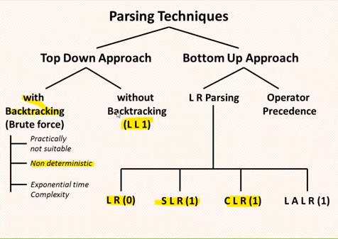
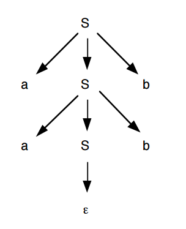
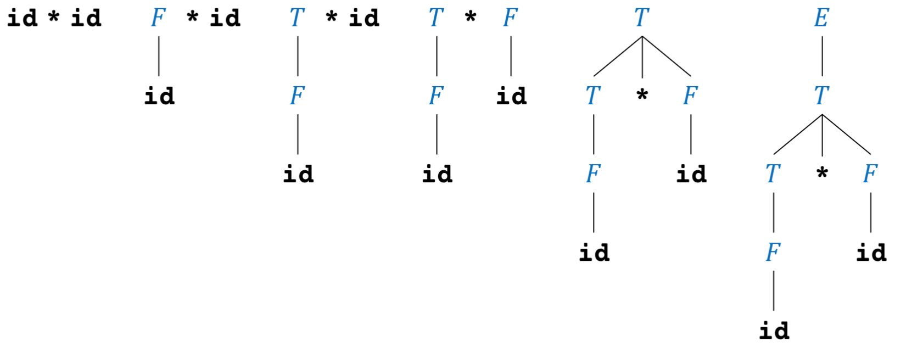

# Análise Sintática

O Analisador sintático também conhecido como parser tem como tarefa principal determinar se o programa de entrada representado pelo fluxo de tokens possui as sentenças válidas para a linguagem de programação.

A analise sintática e a segunda etapa do processo de compilação e na maioria dos casos utiliza gramáticas livres de contexto para especificar a sintaxe de uma linguagem de programação.

## Visão geral


A sintaxe é a parte da gramática que estuda a disposição das palavras na frase e das frases em um discurso. Essa etapa no processo de compilação deve reconhecer as forma do programa fonte e determinar se ele é valido ou não.

Esse modelo pode ser definido utilizando gramáticas livres de contexto que representam uma gramática formal e pode ser escrita através de algoritmos fazem a derivação de todas as possíveis construções da linguagem.

As derivações tem como objetivo determinar se um fluxo de palavras se encaixa na sintaxe da linguagem de programação.

Alguns termos utilizados na definição de linguagens de programação.

**Símbolo**: são os elementos mínimos que compõe uma linguagem. Na linguagem humana são as letras.

**Sentença**: É um conjunto ordenado de símbolos que forma uma cadeia ou string. Na linguagem humana são as palavras.

**Alfabeto**: É um conjunto de símbolos. Na linguagem humana é o conjunto de letras {a, b, c, d, ...}

**Linguagem**: É o conjunto de sentenças, Na linguagem humana são os conjuntos de palavras {compiladores, linguagem, ...}

**Gramática**: É uma forma de representar as regras para formação de uma linguagem.

Trazendo esse conceito para linguagem de programação temos:

**Alfabeto**: {w, h, i, l, e, +, 1, 2, 3}

**Símbolos**: 1, 5, +, w

**Sentença**: while, 123, +1

**Linguagem**: {while, 123, +1}

Dada uma gramática G e uma sentença s o objetivo do analisador sintático é verificar se a sentença s pertence a linguagem G. O analisador sintático recebe do analisador léxico a sequência de tokens que constitui a sentença s e produz uma arvore de derivação se a sentença é válida ou emite um erro se a sentença é inválida.

O analisador léxico é desenvolvido para reconhecer cadeias de caracteres fazendo uma leitura dos caracteres e obtendo a sequência de tokens, esse analisador vê o texto como uma sequência de palavras de uma linguagem regular e reconhece ele através de autômatos finitos determinísticos e não determinísticos.

Já o analisador sintático vê o mesmo texto como uma sequência de sentenças que deve satisfazer as regras gramaticais. É através da gramática que podemos validar expressões criadas na linguagem de programação.

## Gramática Livre de Contexto - GLC

As linguagens de programação em geral pertencem a uma categoria chamada de Linguagens Livres de Contexto. Umas das formas de representar essas linguagens é através de Gramáticas Livres de Contexto que são a base para a construção de analisadores sintáticos. Elas são utilizadas para especificar as regras sintáticas de uma linguagem de programação, uma linguagem regular pode ser reconhecida por automatos finitos determinísticos e não determinísticos, já uma Gramatica Livre de Contexto pode ser reconhecida por um automato de pilha.

Outra aplicação de GLC são os DTD - Definição de Tipos de Documentos - utilizados por arquivos XML que descreve as tags de uma forma natural, as tags deve estar aninhadas afim de lidar com o significado do texto.

Veja o exemplo:


```XML
    <produto><codigo></codigo></produto>
```

Uma gramática descreve naturalmente como é possível fazer construções no programa. Veja o exemplo de um comando if-else em Pascal que deve ter a seguinte forma.


```PASCAL
    if (expressão) then declaração else declaração ;
```

Essa mesma forma em uma Gramática Livre de Contexto pode ser expressada da seguinte maneira:


```
    declaração → if ( expressão ) then declaração else declaração ;
```

A definição formal de uma gramática livre de contexto pode ser representada através dos seguintes componentes:


**G = (N, T, P, S)**


Onde:

- **N** – Conjunto finito de símbolos não terminais.
- **T** – Conjunto finito de símbolos terminais.
- **P** – Conjunto de regras de produções.
- **S** – Símbolo inicial da gramática.


### Terminologias:

**Símbolos terminais**: Conjunto finito de símbolos básicos que formam as palavras da linguagens, são representadas pelo tokens reconhecidos pelo analisador lexico.

**Símbolos não terminais**: Conjunto finito de variáveis utilizadas para representar os conjuntos da linguagem, são formadas pelos terminais e pelos próprios símbolos não terminais.

**Símbolo inicial**: É a variável, simbolo não terminal, que representa o inicio da definição da linguagem.

**Regras de produções**: Representa um conjunto de regras sintáticas que representam a definição da linguagem, indicam como símbolos terminais e não terminais podem ser combinados.

As regras de produção são representadas da seguinte forma:

    {A} → {α}

Onde:

- A é uma variável - simbolo não terminal.
- -> simbolo de produção .
- α é a combinação símbolos terminais e não terminais que representam a forma como uma string vai ser formada.

Veja o exemplo de uma Gramatica Livre de Contexto.

````
G = ({S}, {a, b}, P, S)

P = {   
        S → aSb
        S → λ  
    }
````
Essa gramatica é formada pelas terminais a e b, que são os tokens da linguagem, como regras de produção nos temos aSb que obriga ter um a e b nas extremidades da palavras, o simbolo λ que significa vazio.


## Derivações

A derivação é a substituição do conjunto de símbolos não terminais por símbolos terminais começando pelo símbolo inicial e ao final desse processo o resultado é a forma como a linguagem deve assumir.

Durante a derivação devemos aplicar as regras de produção para substituir cada simbolo não terminal por um simbolo terminal, isso permite identificar se certa cadeia de caracteres pertence a linguagem e as regras expandem todas as produções possíveis. Como resultado desse processo temos a árvore de derivação.

## Tipos de derivação

- **Top-Down**:Examina os símbolos terminais da esquerda para a direita - forma a árvore sintatica de cima para baixo.
    - **L(eft-to-right) L(eft-most-derivation) => LL**

- **Bottom-Up**: Examina os símbolos terminais da direita para a esquerda - forma a árvore sintatica de baixo para cima

    - **S(imple) L(eft-to-right) R(ight-most-derivation) => SLR**
    - **L(eft-to-right) R(ight-most-derivation) => LR**
    - **L(ook) A(head) L(eft-to-right) R(ight-most-derivation) => LALR**




**Independente do algortimo utilizado a derivação deve produzir o mesmo resultado, ou seja, a mesma árvore de derivação, caso o resultado seja diferente temos uma ambiguidade.**


## Árvore de derivação

É uma estrutura em formato de árvore que representa a derivação de uma sentença ou conjunto de sentenças, essa estrutura ira gera a árvores de analise sintática que representa o programa fonte, e é o resultado da analise sintática, essa estrutura facilita é muito utilizada nas etapas seguinda da compilação.

E importante ressaltar que a árvore de análise sintática esta diretamente relacionada a existência de derivações.

Dada a seguinte GLC:

````
G = ({S}, {a, b}, P, S)

P = {   
        S → aSb
        S → λ  
    }
````

Como resultado temos a seguinte árvore de derivação:




### Análise sintática descendente (top‐down):
- O analisador top‐down começa construindo a árvore de análise com um único nó rotulado com o símbolo de início;
- Na sequência ele constrói a árvore de análise completa criando as subárvores uma por uma, em uma ordem da esquerda para a direita, usando de derivações das regras de produção;
- Ao construir uma subárvore, o nó raiz dessa subárvore é criado e depois todas as sub‐subárvores dessa subárvore são geradas;
- Este é um algoritmo recursivo, gerando a árvore em pré‐ordem (nó e depois suas subárvores em uma ordem da esquerda para a direita) – derivação mais à esquerda.


### Análise sintática ascendente (bottom‐up)
- O analisador bottom‐up começa com a primeira marca da entrada;
- Ele repetidamente combina símbolos da entrada com as cadeias nos lados direitos das regras de produção, substituindo as cadeias correspondentes pelos lados esquerdos correspondentes, até que se alcance o símbolo inicial da gramática;
- Utiliza‐se aqui uma aplicação de derivação mais à direita de modo reverso (dos terminais a símbolo inicial).


### Métodos
- Análise sintática descendente recursiva: o analisador é estruturado como um conjunto de procedimentos mutuamente recursivos, um para cada não terminal na gramática;
- Análise descendente LL(k): trata‐se de um método determinístico, baseado em tabela, sem backtracking, que processa a cadeia de entrada da esquerda para a direita (L) e constrói uma derivação mais à esquerda (L) da sentença (não veremos neste curso);
- Análise descendente com backtracking: utiliza‐se uma pilha para controlar o processamento descendente e realiza backtracking para tentar derivações que casem com a cadeia de entrada. Por não ser um método determinístico, embora interessante, não veremos neste curso.

### Análise Sintática Descendente Recursiva

#### Conceitos
- A ideia é traduzir as regras de uma gramática livre de contexto associadas a cada não
terminal em funções com mesmo nome desses não terminais;
- A ação executada pelas funções é analisar a sequência de marcas de entrada e
verificar que elas formam uma sequência permitida pela gramática;
- O processo básico é traduzir regras da gramática (em EBNF) como:
````
S = 𝛼;
````

Em funções como:
````
void S() {
    T(𝛼);
}
````
Em que T(𝛼) representa uma transformação adequada sobre o lado direito da regra

- Em outras palavras, a própria gramática serve como um guia para a implementação do analisador – o analisador é um conjunto de funções mutualmente recursivas;
- Para descrever a gramática em questão, utiliza‐se a metalinguagem EBNF (substitui as recursões por repetições);
-  Exemplo de gramática em EBNF
````
goal = expr;
expr = term,{('+'|'-'),term};
term = factor,{('*'|'/'|'%'), factor };
factor = '(',expr,')'|number|id;
````

Em que **number** e **id** são marcas produzidas pelo **analisador léxico** para as quais assume‐se que existem expressões regulares definidas.

## Regras de transformação - Análise Sintática Descendente Recursiva

- **Regra 1**
    - Se 𝛼 é um terminal (expressão regular ou um símbolo simples) da gramática, por exemplo, exp, a ação a ser executada é verificar se este símbolo é igual à marca retornada pelo analisador léxico e, no caso positivo, pedir um próximo símbolo ao analisador léxico (obter mais uma marca). Senão, reportar um erro e então parar ou tentar se recuperar;
    - Então, a transformação será: **𝑇(exp) → aceitar(exp)**
    - A função aceitar() representa as ações descritas anteriormente.

- **Regra 2**
    - Se 𝛼 é um não terminal 𝐴 da gramática, a ação a ser executada é executar uma função de mesmo nome, A();
    - Então, a transformação será: **𝑇(𝐴) → A()**

- **Regra 3**
    - Se 𝛼 é uma sequência de terminais ou não terminais como 𝛼1𝛼2 ... 𝛼𝑛 a ação é traduzir cada elemento na sequência apresentada;
    - Então, a transformação será uma sequência de transformações:

        **𝑇(𝛼1𝛼2 ... 𝛼𝑛) → 𝑇(𝛼1); 𝑇(𝛼2); ... 𝑇(𝛼𝑛)**

- **Regra 4**
    - Se 𝛼 consiste de formas alternativas como 𝛼1|𝛼2| ... |𝛼𝑛 a ação é gerar ações para cada alternativa;
    - Então, a transformação 𝑇(𝛼1|𝛼2| ... |𝛼𝑛) será:

```Java
switch(valor){
    valor𝛼1 ∶ 𝑇(𝛼1); break;
    valor𝛼2 ∶ 𝑇(𝛼2); break;
    ...
    valor𝛼𝑛 ∶ 𝑇(𝛼𝑛); break;
}
```

    - Para gramáticas que proíbem que as alternativas tenham um prefixo comum e que um símbolo de lookahead (marca) do analisador léxico é suficiente para tomar uma decisão (gramáticas LL(1) ), a transformação pode ser assim entendida:

````Java
switch(marca){
    inicia(valor𝛼1 ) ∶ 𝑇(𝛼1); break;
    inicia(valor𝛼2 ) ∶ 𝑇(𝛼2); break;
    ...
    inicia(valor𝛼𝑛 ) ∶ 𝑇(𝛼𝑛); break;
}
````

    - Aqui a função inicia() testa se a marca inicia uma das alternativas. Se apenas um dos testes for verdadeiro então pode‐se escolher uma alternativa de modo determinístico.

- **Regra 5**
    - Se 𝛼 é repetida zero ou mais vezes como em {𝛼} a ação é traduzir em uma repetição da transformação deste símbolo;
    - Então, a transformação 𝑇({𝛼}) será:
````Java
    while(marca ∈ iniciadores(𝛼)){
        𝑇(𝛼);
    }
````
    - E para repetições que não podem ser nulas, como 𝑇(𝛼{𝛼}):
````Java
    𝑇(𝛼);
    while(marca ∈ iniciadores(𝛼)){
        𝑇(𝛼);
    }
````

## Análise Sintática Ascendente

### Conceitos
- Analisadores sintáticos ascendentes (bottom‐up parsers) constroem uma árvore sintática começando com suas folhas e trabalhando em direção à raiz;
- O analisador constrói uma folha na árvore para cada palavra retornada pelo scanner. Elas formam a borda inferior da árvore sintática;
- Para criar uma derivação, o analisador acrescenta camadas de não terminais em cima das folhas em uma estrutura orientada tanto pela gramática quanto pela parte inferior parcialmente completa da árvore sintática;
- Em qualquer estágio da análise, a árvore parcialmente completa representa seu estado;
- O analisador trabalha junto à fronteira superior dessa árvore sintática completada parcialmente;
- Essa fronteira corresponde à forma sentencial atual na derivação sendo criada pelo analisador.
- Para estender a fronteira para cima, o analisador examina a fronteira atual em busca de uma subcadeia que corresponda ao lado direito de alguma produção 𝐴 → 𝛽;
- Por exemplo, considere uma gramática de expressões assim:
````
𝐸 → 𝐸 + 𝑇 | 𝑇
𝑇 → 𝑇 * 𝐹 | 𝐹
𝐹 → (𝐸) |id
````
- E a seguinte entrada (considerar id qualquer identificador): id * id.

- O processo de análise ascendente está ilustrado a seguir:



- O objetivo da análise ascendente é construir uma árvore de derivação reversa à direita, assim: 𝐸 ⇒ 𝑇 ⇒ 𝑇 * 𝐹 ⇒ 𝑇 * id ⇒ 𝐹 * id ⇒ id * id.

### Conceitos
- Um handle (gancho ou alça) é uma subcadeia da cadeia de entrada que casa com o lado direito de alguma produção da gramática e cuja redução representa um passo no caminho da derivação mais à direita de modo reverso;
- Assim, para estender a fronteira para cima, o analisador examina a fronteira atual em busca de uma subcadeia que corresponda ao lado direito de alguma produção 𝐴 → 𝛽;
- Se casar 𝛽 na fronteira, com um terminal 𝑘 na extremidade direita da entrada, então pode‐se substituir 𝛽 por 𝐴, para se criar uma nova fronteira;

#### Exemplos:

| Forma sentencial à direita | Fronteira | Produção utilizada na redução |
| --- | --- | --- |
| id<sub>1</sub>*<sub>id2</sub> | id<sub>1</sub> | 𝐹 → id |
| 𝐹*id<sub>2</sub> | 𝐹 |  𝑇 → 𝐹 |
| 𝑇*id<sub>2</sub> | id<sub>2</sub> | 𝐹 → id |
| 𝑇*𝐹 | 𝑇*𝐹 |  𝐸 → 𝑇*𝐹 |


- Se a substituição de 𝐴 por 𝛽 em 𝑘 forma uma próxima etapa em uma derivação válida para a cadeia de entrada, então o par ⟨𝐴 → 𝛽, 𝑘⟩ é um handle (alça) na derivação atual, e o analisador deverá substituir 𝛽 por 𝐴;
- Nos exemplos anteriores, ⟨𝐹 → id, id1⟩, ⟨𝑇 → 𝐹, 𝐹⟩, ⟨𝐹 → id, id2⟩ e ⟨𝐸 → 𝑇*𝐹, 𝑇*𝐹⟩ são exemplos de handles;
- Essa substituição é chamada redução, pois reduz o número de símbolos (terminais e não terminais) na fronteira, a menos que |𝛽| = 1;
- Se o analisador estiver criando uma árvore sintática, ele constrói um nó para 𝐴, acrescenta‐o à árvore e conecta os nós representando 𝛽 como filhos de 𝐴.
- O analisador sintático ascendente repete um processo simples. Encontra um handle ⟨𝐴 → 𝛽, 𝑘⟩ na fronteira, e substitui a ocorrência de 𝛽 em 𝑘 por 𝐴. Esse processo continua até que ele:
    - (a) Reduza a fronteira para um único nó que representa o símbolo‐alvo da gramática, ou
    - (b) Não possa encontrar um handle.
- No primeiro caso, o analisador encontrou uma derivação; se também tiver consumido todas as palavras no fluxo de entrada (ou seja, a próxima palavra é eof), então a análise tem sucesso.
- No segundo caso, ele não pode criar uma derivação para o fluxo de entrada e deve relatar esta falha.

- Em outras palavras, iniciando com uma cadeia 𝑤 de terminais, se 𝑤 é uma sentença da gramática ocorre a seguinte derivação: 𝑆 = 𝛾1 ⇒ 𝛾2 ⇒ ... 𝛾𝑛−1 ⇒ 𝛾𝑛 = 𝑤
- Para reconstruir esta derivação de modo reverso, ascendente, localiza‐se o handle 𝛽𝑛 na forma sentencial 𝛾𝑛 e o substitui pela cabeça da produção 𝐴𝑛 → 𝛽𝑛 para se obter 𝛾𝑛−1;
- Repete‐se este processo até se alcançar uma forma sentencial que é 𝑆, o símbolo inicial da gramática.
- LR(1): lê o texto de entrada da esquerda (Left) para a direita e realiza derivações à direita (Right) utilizando 1 terminal de verificação à frente (lookahead);
- Trata‐se de um método dirigido por tabela (autômato determinístico);
- A localização eficiente do handle é a chave para a análise ascendente;
- Um analisador LR(1) usa um autômato de localização de handles codificado em duas tabelas, chamadas Action e Goto;
- No lugar de criar uma árvore sintática explícita, o algoritmo mantém a fronteira superior atual da árvore parcialmente construída em uma pilha, intercalada com números de estados de um autômato de itens (conjuntos de handles), que permite a escolha correta de reduções em um processo de análise sintática;
- Em qualquer ponto na análise, a pilha contém um prefixo da fronteira atual. Além deste prefixo, a fronteira consiste em nós‐folha. Uma variável do algoritmo mantém a primeira palavra do sufixo que se encontra além do conteúdo da pilha – este é o terminal de verificação à frente.
- O algoritmo que cria a tabela e o algoritmo que interpreta a tabela LR(1) são bem complexos para simular manualmente, mesmo para gramáticas simples;
- No entanto, o funcionamento básico da análise LR(1) pode ser explicado pelo processo deslocar‐reduzir (shift-reduce);
- Considerar a gramática apresentada a seguir:

1. 𝑃 → 𝐸
2. 𝐸 → 𝐸 + 𝑇
3. 𝐸 → 𝑇
4. 𝑇 → id ( 𝐸 )
5. 𝑇 → id

- Uma ação de deslocar (shift) consome uma marca da entrada e a insere (push) na pilha;
- Uma ação de reduzir (reduce) aplica uma regra na forma 𝐴 → 𝛼 da gramática substituindo a forma sentencial 𝛼 (pop) na pilha com o não terminal 𝐴 (push);
- Quem decide a ação de reduzir ou executar em cada passo é o algoritmo LR(1) com a tabela LR(1), gerada diretamente da gramática;
- A gramática pode ter recursões à esquerda. A única restrição é que ela não pode ser ambígua.

### Exemplo do mecanismo deslocar‐reduzir
- Considerar a entrada id(id+id) a ser analisada com a gramática do slide 11:

| Pilha | Entrada | Ação |
| --- | --- | --- |
| | id(id+id)$ | shift |
| id | (id+id)$ | shift |
| id( | | id+id)$ | shift |
| id(id |  +id)$ | reduce 𝑇 → id |
| id(𝑇 | +id)$ | reduce 𝐸 → 𝑇 |
| id(𝐸 | +id)$ | shift |
| id(𝐸+ | id)$ | shift |
| id(𝐸+id | )$ | reduce 𝑇 → id |
| id(𝐸+𝑇 | )$ | reduce 𝐸 → 𝐸+𝑇 |
| id(𝐸 | )$ | shift |
| id(𝐸) | $ | reduce 𝑇 → id(𝐸) |
| 𝑇 | $ | reduce 𝐸 → 𝑇 |
| 𝐸 | $ | reduce 𝑃 → 𝐸 |
| 𝑃 | $ | aceitar | 


### Conflitos possíveis

- Dois tipos tipos de conflitos podem ocorrer em uma gramática LR: conflito deslocar‐reduzir e conflito reduzir‐reduzir;

##### Conflito deslocar-reduzir

- O conflito deslocar‐reduzir indica que em um ponto da análise pode‐se tanto executar um deslocamento quanto uma redução. Por exemplo, as regras 𝑇 → id (𝐸) e 𝑇 → id tem um conflito desse tipo caso a análise já tenha considerado a marca id. Normalmente indica que existe uma ambiguidade na gramática e/ou ambiguidade na
precedência dos operadores;

##### Conflito reduzir-reduzir

- O conflito reduzir‐reduzir indica que duas regras já foram totalmente casadas e qualquer uma serve para redução. Por exemplo, as regras 𝑆 → id (𝐸) (declaração de função) e 𝐸 → id(𝐸) (chamada de função) tem um conflito desse tipo caso a análise já tenha passado pelo seus lados direitos. Normalmente indica que existe uma ambiguidade na gramática.

