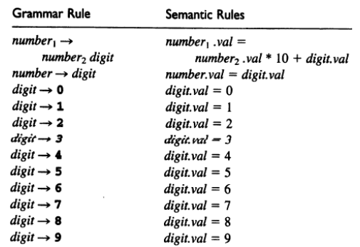
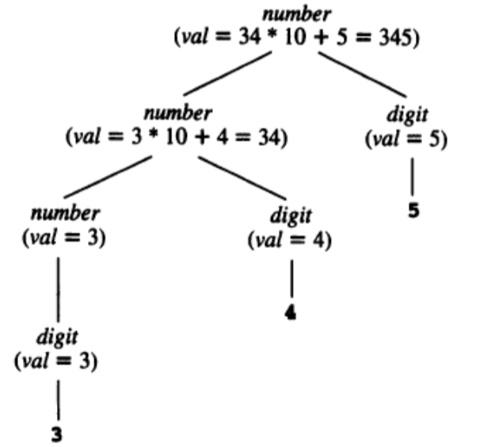
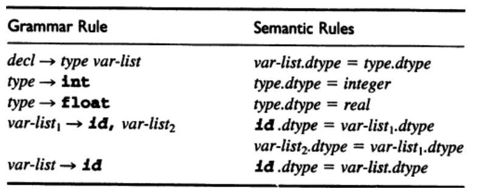
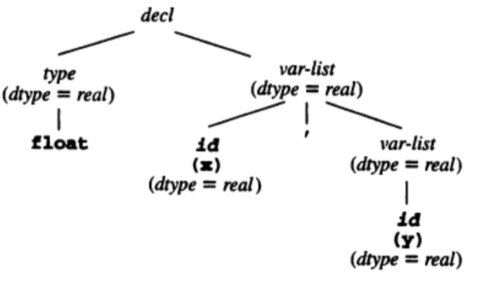
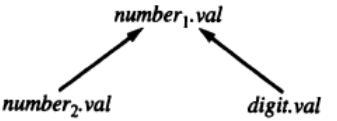
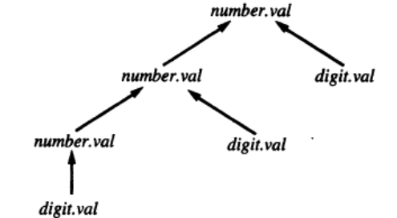
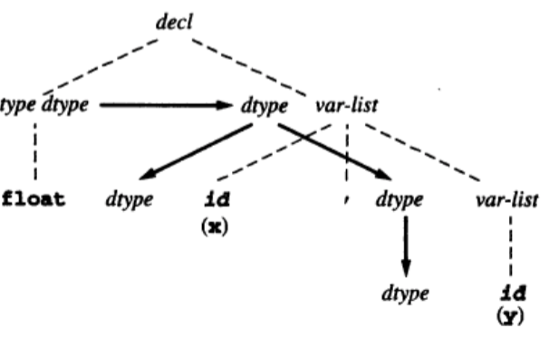

### Análise semântica


Até o momento vimos as etapas de análise léxica, que quebra o programa fonte em tokens e a analise sintática, que valida as regras a sintaxe da linguagem de programação.

Não é possível representar com expressões regulares ou com uma gramática livre de contexto regras como: todo identificador deve ser declarado antes de ser usado. Muitas verificações devem ser realizadas com meta-informações e com elementos que estão presentes em vários pontos do código fonte, distantes uns dos outros. O analisador semântico utiliza a árvore sintática e a tabela de símbolos para fazer as analise semantica.

A analise semântica é responsavel por verificar aspectos relacionados ao significado das instruções, essa é a terceira etapa do processo de compilação e nesse momento ocorre a validação de uma serie regras que não podem ser verificadas nas etapas anteriores.

É importante ressaltar que muitos dos erros semanticos tem origem de regras dependentes da linguagem de programacao.

As validações que não podem ser executadas pelas etapas anteriores devem ser executadas durante a análise semântica a fim de garantir que o programa fonte estaja coerente e o mesmo possa ser convertido para linguagem de máquina.

A análise semântica percorre a árvore sintática relaciona os identificadores com seus dependentes de acordo com a estrutura hierarquica.

Essa etapa também captura informações sobre o programa fonte para que as fases subsequentes gerar o código objeto, um importante componente da analise semântica é a verificação de tipos, nela o compilador verifica se cada operador recebe os operandos permitidos e especificados na linguagem fonte.

Um exemplo que ilustra muito bem essa etapa de validação de tipos é a atribuição de objetos de tipos ou classe diferentes. Em alguns casos, o compilador realiza a conversão automática de um tipo para outro que seja adequado à aplicação do operador. Por exemplo a expressão.

````
var s: String;
s := 2 + ‘2’;
````

Veja o exemplo de um código em Object Pascal:

````Pascal 
function Soma(a, b : Integer) : Integer;
var 
  i : Integer;
begin
  i := a + b;
  Result := i;
end;
````

No exemplo acima o analisador semântico de ter uma série de preocupações para validar o significado de cada regra de produção.

Vamos utilizar como exemplo a regra de atribuição:
````
i := a + b;`
````

- O identificador i foi declarado?
- O identificador i é uma variável?
- Qual o escopo da variável i?
- Qual é o tipo da variável i?
- O tipo da variável i é compatível com os demais identificadores, operadores?

Os tipo de dados são muito importantes nessa etapa da compilação, eles são uma notações que as linguagens de programação utilizam para representar um conjunto de valores. Com base nos tipos o analisador semântico pode definir quais valores podem ser manipulados, isso é conhecido com type checking.


- A análise semântica realizada antes da execução do código é conhecida por análise semântica estática e basicamente cuida da verificação de tipos, criação da tabela de símbolos e geração de código intermediário;
- A análise semântica realizada durante a execução do código é conhecida por análise semântica dinâmica e cuida de aspectos que não podem ser previstos durante a análise estática, tais como divisão por zero e verificação dos limites de um vetor;
- Diferente dos métodos de análise sintática, não há um padrão de algoritmo e nem geradores de análise semântica – depende fortemente da linguagem em questão – em linguagens dinâmicas como LISP praticamente não há análise semântica enquanto que
em linguagens fortemente baseadas em tipos como C e Pascal ela é muito forte.

### Sistemas de Tipos de Dados e Inferência de tipos

O sistema de tipos de dados podem ser divididos em dois grupos: sistemas dinâmicos e sistemas estáticos. Muitas das linguagens utilizam o sistema estático, esse sistema é predominante em linguagens compiladas, pois essa informação é utilizada durante a compilação e simplifica o trabalho do compilador.

#### Sistemas estáticos

 Linguagem como C, Java, Pascal obrigam o programador a definir os tipos das variáveis e retorno de funções, o compilador pode fazer varias checagens de tipo em tempo de compilação.

### Sistemas dinâmicos

Variáveis e retorno de funções não possuem declaração de tipos, como exemplo temos linguagens como Python , Perl e PHP.

#### Inferência de tipos

Algumas linguagens utilizam um mecanismo muito interessantes chamado inferência de tipos, que permite a uma variavel assumir varios tipos durante o seu ciclo de vida, isso permite que a ela possa ter varios varios valores. Linguagens de programação como Haskel tira proveito desse mecanismo. Nesses casos o compilador infere o tipo da variável em tempo de execução, esse tipo de mecanismos esta diretamente relacionado ao mecanismo de Generics do Java e Delphi Language. A validação de tipos passa a ser realizada em tempo de execucao.

## Atributos e gramáticas de atributos

Atributos ou propriedades de entidades da linguagem são computados e então são definidas regras semânticas (ou equações de atributos) que indicam como a computação desses atributos estão relacionados às regras gramaticais da linguagem;
- São úteis em linguagens que obedecem ao princípio da semântica direcionada por sintaxe – o conteúdo semântico do programa é muito próximo de sua sintaxe;
- Uma ferramenta que simplifica o entendimento das computações semânticas são as árvores de sintaxe abstrata;
- Infelizmente estes processos são manuais ou ad‐hoc;
- Normalmente as computações semânticas são executadas durante a análise sintática – consegue‐se executá‐la em um único passo;
- Em linguagens onde isso não é possível realiza‐se a análise semântica atrasada, que implica normalmente em mais de um passo na compilação.

### Atributo

É qualquer propriedade de uma construção de uma linguagem de programação;

Exemplos típicos:

- **Tipo de dados de uma variável**: é importante para linguagens estaticamente “tipadas” como C e Pascal. Um verificador de tipos é um analisador semântico que calcula o atributo de tipo de dados de todos os elementos da linguagem;
- **Valor de uma expressão**: são dinâmicos e o compilador irá gerar código para eles. Algumas expressões são constantes e o analisador semântico pode avaliá‐los; 
- **Localização de variáveis na memória**: pode ser estática ou dinâmica dependendo da linguagem (FORTRAN – estático; LISP – dinâmico; C e Pascal – ambos);
- **Código objeto de um procedimento**: é um atributo estático;
- **Número de dígitos significativos de um número**: não é tratado durante a compilação, mas gerador de varredura pode limitá‐lo.

### Gramática de atributos

Atributos são associados diretamente aos símbolos gramaticais (terminais e não terminais) em semântica dirigida por sintaxe;
- A semântica dirigida por sintaxe implica que para cada regra gramatical
𝑋0 → 𝑋1𝑋2 ... 𝑋𝑛 (𝑋0 é um não terminal) e uma coleção de atributos 𝑎1 ... 𝑎𝑘, os valores de atributos 𝑋𝑖.𝑎𝑗 de cada símbolo gramatical 𝑋𝑖 são relacionados aos valores de atributos de outros símbolos da regra;
- Cada relacionamento é descrito por uma equação de atributo ou regra semântica e
possui a forma: 𝑋𝑖.𝑎𝑗 = 𝑓𝑖𝑗 (𝑋0.𝑎1, ... , 𝑋0.𝑎𝑘, 𝑋1.𝑎1, ... , 𝑋1.𝑎𝑘 ... 𝑋𝑛.𝑎1, ... , 𝑋𝑛.𝑎𝑘, )
- Uma gramática de atributos para atributos 𝑎1 ... 𝑎𝑘 é uma coleção dessas equações;
- Na prática essas equações são simples e não dependem de um grande número de
outros atributos.


#### Exemplo de gramática de atributos

##### Exemplo 1

- Seja a gramática:
````
𝑛𝑢𝑚𝑏𝑒𝑟 → 𝑛𝑢𝑚𝑏𝑒𝑟 𝑑𝑖𝑔𝑖𝑡 | 𝑑𝑖𝑔𝑖𝑡
𝑑𝑖𝑔𝑖𝑡 → 0 | 1 | 2 | 3 | 4 | 5 | 6 | 7 | 8 | 9
````

• Sua gramática de atributos poderia ser assim definida:



##### Exemplo 1 - Computação dos atributos na árvore de análise sintática



##### Exemplo 2

Seja a gramática:
````
𝑑𝑒𝑐𝑙 → 𝑡𝑦𝑝𝑒 𝑣𝑎𝑟‐𝑙𝑖𝑠𝑡
𝑡𝑦𝑝𝑒 → int | float
𝑣𝑎𝑟‐𝑙𝑖𝑠𝑡 → id, 𝑣𝑎𝑟‐𝑙𝑖𝑠𝑡 | id
````

- Sua gramática de atributos poderia ser assim definida:



##### Exemplo 2 - Computação dos atributos na árvore de análise sintática




### Grafos de dependência


- Dada uma gramática de atributo, cada escolha de regra gramatical possui um grafo de dependência associado;
- Este grafo possui um nó rotulado para cada atributo 𝑋𝑖.𝑎𝑗 de cada símbolo na regra da gramática e para cada equação de atributo na forma 𝑋𝑖.𝑎𝑗 = 𝑓𝑖𝑗 (... , 𝑋𝑚.𝑎𝑘, ... associado há uma aresta de cada nó 𝑋𝑚.𝑎𝑘 do lado direito direcionada para o nó 𝑋𝑖.𝑎𝑗 (𝑋𝑖.𝑎𝑗 depende de 𝑋𝑚.𝑎𝑘);
- Para uma cadeia de símbolos legal de uma linguagem gerada por uma gramática livre de contexto o grafo de dependência desta cadeia é a união dos grafos de dependência das escolhas de regras gramaticais representando cada nó (não folha) da árvore de
análise da cadeia.

No Exemplo 1 acima, a regra:
````
𝑛𝑢𝑚𝑏𝑒𝑟1.𝑣𝑎𝑙 = 𝑛𝑢𝑚𝑏𝑒𝑟2.𝑣𝑎𝑙 ∗ 10 + 𝑑𝑖𝑔𝑖𝑡.𝑣𝑎𝑙`
````

Possui o seguinte grafo de dependência:



Omitindo os índices dos símbolos, já que as diversas ocorrências na árvore são distintas, tem‐se o seguinte grafo de dependência para a cadeia 345:




### Grafos de dependência
- Em um grafo de dependência pode‐se indicar também a árvore de análise, desenhada com tracejado para não ofuscar as dependências;
- O grafo de dependência do Exemplo 2 do slide 8 para a cadeia float x,y é assim desenhado:



### Discussão sobre algoritmos
- Para grafos de dependência direcionados e acíclicos, o próprio grafo de dependência indica as restrições que o algoritmo deve seguir para computar o valor dos atributos;
- Para isso, pode‐se utilizar algoritmos de ordenação topológica que, partindo das folhas do grafo (cujos valores podem ter sido obtidos pelo analisador sintático ou léxico) seguem as arestas computando os atributos (podem existir diversas ordenações
topológicas para o mesmo grafo);
- Métodos que utilizam ordenação topológica sobre uma árvore criada durante a análise sintática são denominados de métodos de árvore de análise, mas possuem dois problemas principais:
    - Adicionam complexidade durante a compilação;
    - Atrasam a compilação para determinar se a gramática possui circularidade.
- Uma alternativa adotada na prática é fixar uma ordem para avaliar os atributos de acordo com a gramática em questão. Embora ainda sejam baseados na árvore de análise, esses métodos são denominados de métodos baseados em regras.


